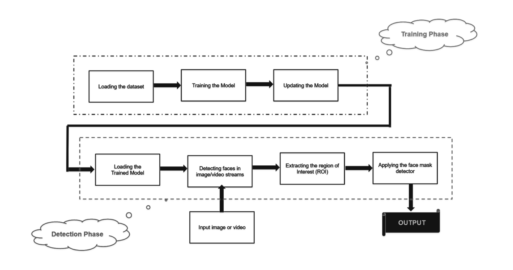
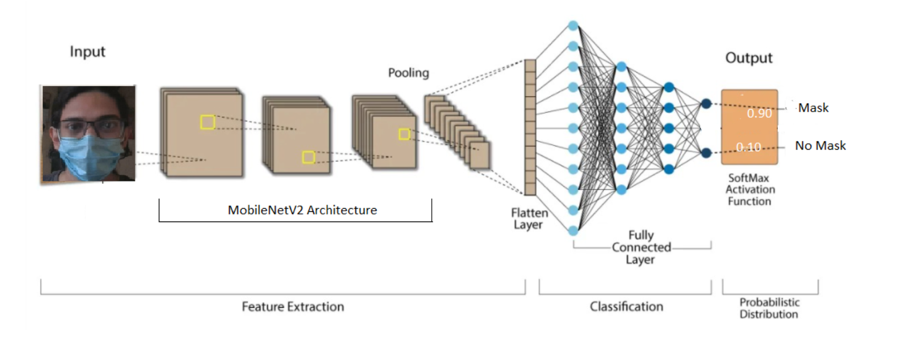
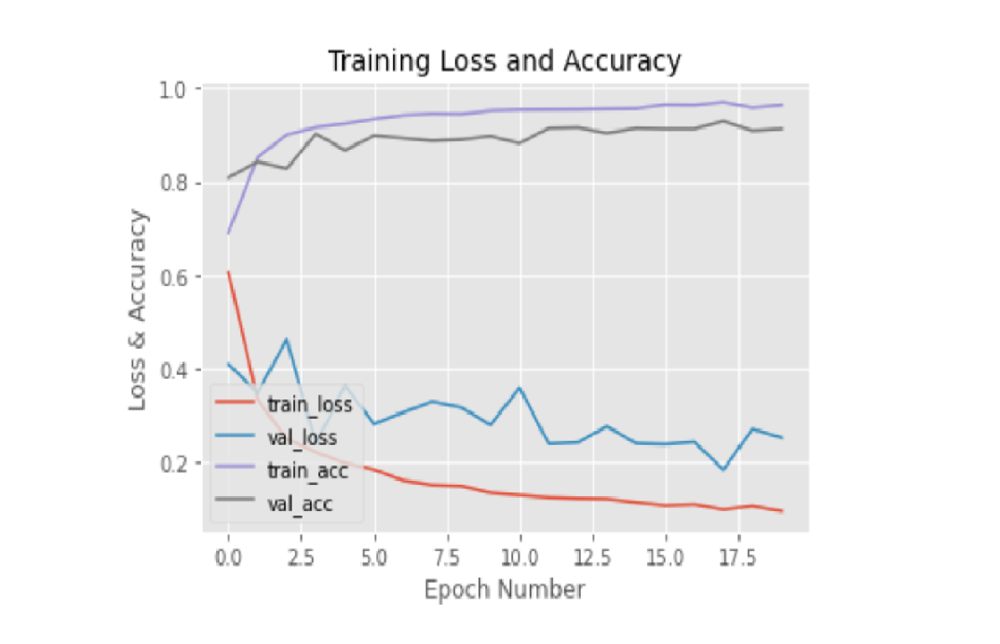
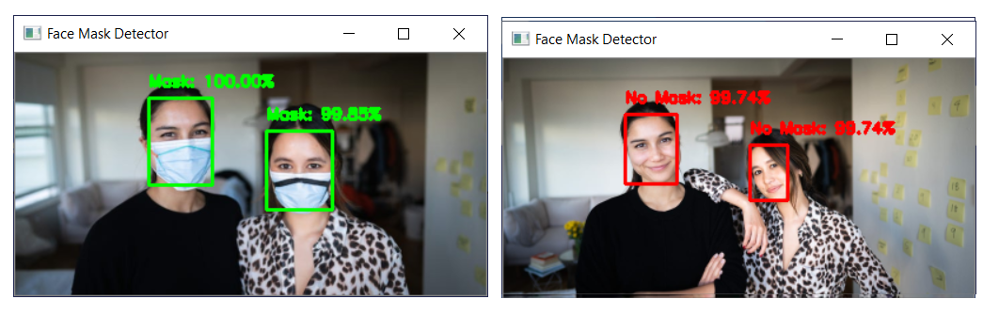
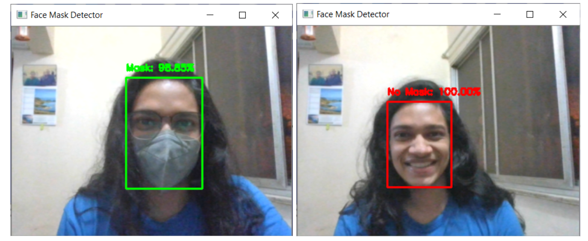

## Face Mask Detection using Machine Learning in Python
The world witnessed the outbreak of the Coronavirus (COVID-19) pandemic during the year 2020. The new normal post the pandemic involves the compulsory wearing of face masks. It has been shown that use of a face mask significantly reduces risk of transmission of the virus. However, it may not always be possible to manually enforce this policy. This project aims to
automate this process by detecting the presence of masks on human faces using Supervised Machine Learning and Image Processing.

## Architecture and Block Diagram

### Block Diagram

The model implemented for mask detection uses 6 convolutional layers on top of the MobileNetV2 predefined architecture. The images were loaded, preprocessed and converted to Numpy arrays for training the model. The dataset was split in 80:20 ratio for training and testing using Scikit Learn. 

The images were augmented with transformations and then the MobileNetV2 architecture was loaded along with the 6 convolutional layers (Average Pooling, Flatten, RELU (Dense), Dropout, Softmax (Output)). The model was trained using this architecture which is shown below.

### Architecture

For the final phase of implementation, the face detection model and mask detection model were loaded. We take one frame if it is a static image and a stream of frames if it is a live video stream. The ROI is located using the first model. The cropped images are sent to the mask detection model and output is predicted. The face is highlighted on the frame and labeled with the predicted output.

## Result

The image below shows the Training Loss and Accuracy obtained plotted against the epochs of training.

### Screenshots

##### GUI Home Screen

##### Uploaded test images output

##### Live Video Stream Output

## Tech Stack

The implementation was done on *Jupyter Notebook* and *VS Code*. 

The packages used were:

- Tensorflow 2.1.0
- Keras 2.1.0
- Scikit Learn 0.23.2
- Matplotlib 3.2.2
- Numpy 1.19.1
- OpenCV 4.5.0
- Tkinter (for the GUI)

## Conclusion
In this project, we have implemented a Face Mask Detection system using Machine Learning in Python. The implemented model for mask detection requires images cropped to faces. In the final phase of our project, we extended the previously trained model to any image upload (not cropped to faces) and a live video stream. Each image is first passed through the face detection model to detect faces and the images cropped to the face ROI are then passed to the previously trained mask detection model.

 

#### This project was done by: 
Adwait Hegde, Ashish Todi, Vedanth Raja